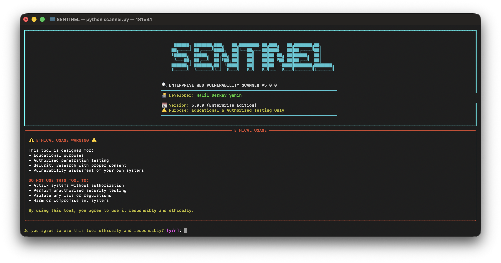

# SENTINEL

**Enterprise Security Assessment Platform v5.0.0**

A production-ready web vulnerability scanner with 48 security modules and full OWASP Top 10 2025 coverage. Built for professional penetration testing, bug bounty hunting, and security research.

[](https://python.org)
[](LICENSE)
[]()

---

## Table of Contents

- [Screenshots](#screenshots)
- [Features](#features)
- [Quick Start](#quick-start)
  - [Docker Installation](#docker-installation)
  - [Local Installation](#local-installation)
- [Usage](#usage)
  - [Web Interface](#web-interface)
  - [CLI Examples](#cli-examples)
- [Security Modules](#security-modules)
- [Architecture](#architecture)
- [Documentation](#documentation)
- [Output Formats](#output-formats)
- [Testing](#testing)
- [Contributing](#contributing)
- [License](#license)

---

## Screenshots

### Web Interface


*Modern web dashboard with real-time scanning progress and interactive reporting*

### CLI Scanner


*Command-line interface with detailed vulnerability detection and color-coded output*

---

## Features

**Core Capabilities**
- 48 active scanning modules with OWASP Top 10 2025 compliance
- External tool integration (Nmap, Nikto, Gobuster, John, Hashcat)
- Custom wordlist mining with target-specific payload generation
- Attack chain correlation and automatic vulnerability linking
- Multi-format reporting (JSON, HTML, Markdown, SARIF, Nuclei)

**Advanced Features**
- AI-powered technical and executive reporting via Google Gemini
- Authenticated scanning with session management
- WebSocket, GraphQL, gRPC protocol support
- CVSS v3.1 scoring with automatic severity calculation
- Docker deployment with full orchestration

**Performance**
- Async architecture with configurable concurrency
- Redis caching for improved scan performance
- Rate limiting and WAF evasion capabilities
- Distributed scanning support via Celery

**v5.0.0 New Features**
- 📋 **Scan Templates**: 8 predefined scan presets (OWASP Top 10, API Security, Quick Scan, etc.)
- 📊 **Scan History API**: Persistent scan results with history browsing
- 🔍 **Enhanced Health Checks**: Detailed component status monitoring
- 🔄 **Robust WebSocket**: Exponential backoff reconnection
- ⚡ **Dynamic Module Discovery**: Optional runtime module loading

---

## Quick Start

### Docker Installation

Fastest way to get started:

```bash
# Clone repository
git clone https://github.com/halilberkayy/SENTINEL.git
cd SENTINEL

# Start with Docker Compose
docker-compose -f docker/docker-compose.yml up -d

# Access web interface
open http://localhost:8000
```

### Local Installation

For development or custom deployments:

```bash
# Install dependencies
poetry install

# Configure environment
cp .env.example .env
# Edit .env with your settings

# Initialize database
alembic upgrade head

# Start services
python web_app.py
```

**System Requirements**
- Python 3.10+
- 4GB RAM minimum (8GB recommended)
- PostgreSQL 13+ (optional, SQLite works for development)
- Redis 6+ (optional, for caching)

---

## Usage

### Web Interface


1. Navigate to `http://localhost:8000`
2. Enter target URL
3. Select scan modules or use "All Modules"
4. Configure authentication (if needed)
5. Start scan and monitor real-time progress
6. Download reports in preferred format

### CLI Examples


**Basic Scans**
```bash
# Quick vulnerability scan
poetry run scanner -u https://example.com

# Comprehensive scan with all modules
poetry run scanner -u https://example.com --modules all

# Specific module scan
poetry run scanner -u https://example.com -m xss_scanner,sqli_scanner
```

**Advanced Scans**
```bash
# Authenticated scan with cookie
poetry run scanner -u https://example.com \
  --auth-type cookie \
  --auth-cookie "session=abc123"

# High concurrency scan
poetry run scanner -u https://example.com \
  --modules all \
  --rate-limit 50 \
  --timeout 60

# Export to SARIF for GitHub Security
poetry run scanner -u https://example.com \
  --output sarif \
  --output-file results.sarif
```

**External Tool Integration**
```bash
# Install external tools first
brew install nmap nikto gobuster john hashcat  # macOS
apt install nmap nikto dirb john hashcat       # Linux

# Run external tools only
poetry run scanner -u https://example.com \
  -m nmap_scanner,nikto_scanner,gobuster_scanner
```

---

## Security Modules

### Critical Risk Modules

| Module | Description | Payload Count |
|--------|-------------|---------------|
| XSS Scanner | Cross-Site Scripting (Reflected, Stored, DOM) | 200+ |
| SQL Injection | Database fingerprinting and injection | 150+ |
| Command Injection | OS command injection and SSTI | 100+ |
| LFI/RFI Scanner | Local and remote file inclusion | 80+ |
| XXE Scanner | XML External Entity attacks | 50+ |
| SSTI Scanner | Template injection (Jinja2, Twig, Freemarker) | 75+ |
| Deserialization | Insecure deserialization (Java, PHP, Python, .NET) | 60+ |
| Webshell Scanner | Backdoor and webshell detection | 40+ |

### High Risk Modules

| Module | Description |
|--------|-------------|
| SSRF Scanner | Server-Side Request Forgery |
| JWT Scanner | JWT configuration and vulnerability audits |
| Auth Scanner | Authentication mechanism testing |
| API Scanner | REST/GraphQL API security analysis |
| BAC Scanner | Broken Access Control detection |
| Proto Pollution | JavaScript Prototype Pollution |
| Cloud Scanner | Cloud service misconfiguration detection |
| GraphQL Scanner | GraphQL-specific vulnerability testing |
| Race Condition | TOCTOU and parallel request attacks |

### Medium Risk Modules

| Module | Description |
|--------|-------------|
| CSRF Scanner | Cross-Site Request Forgery |
| CORS Scanner | CORS policy misconfiguration |
| Open Redirect | Unvalidated redirect detection |
| Directory Scanner | Path enumeration and discovery |

### Reconnaissance Modules

| Module | Description |
|--------|-------------|
| Security Headers | HTTP security header analysis |
| Subdomain Enum | Subdomain discovery and enumeration |
| Port Scanner | Network port scanning and service detection |
| JS Secrets | JavaScript file credential extraction |
| Supply Chain | Dependency and supply chain analysis |
| Exception Scanner | Error handling and information disclosure |

### External Tools

| Tool | Purpose | Installation Required |
|------|---------|----------------------|
| Nmap | Network discovery and port scanning | Yes |
| Nikto | Web server vulnerability scanning | Yes |
| Gobuster | Directory and DNS brute-forcing | Yes |
| John/Hashcat | Password hash cracking | Yes |

**OWASP Top 10 2025 Coverage**

| OWASP ID | Category | Covered Modules |
|----------|----------|-----------------|
| A01 | Broken Access Control | BAC, Auth, JWT, CORS |
| A02 | Cryptographic Failures | JWT, Headers, Security Config |
| A03 | Injection | SQLi, XSS, Command Injection, XXE, SSTI |
| A04 | Insecure Design | API, GraphQL, WebSocket |
| A05 | Security Misconfiguration | Headers, Cloud, Robots.txt |
| A06 | Vulnerable Components | Supply Chain, Dependency Scanner |
| A07 | Authentication Failures | Auth, JWT, CSRF |
| A08 | Software Integrity Failures | Deserialization, Proto Pollution |
| A09 | Logging Failures | Logging Scanner |
| A10 | Server-Side Request Forgery | SSRF Scanner |

---

## Architecture

### Project Structure

```
SENTINEL/
├── src/
│   ├── api/              # FastAPI REST API endpoints
│   ├── core/             # Core engine, config, auth, database
│   ├── modules/          # 48 scanning modules
│   ├── plugins/          # Plugin system for extensibility
│   ├── payloads/         # Vulnerability payloads and wordlists
│   ├── reporting/        # Multi-format report generators
│   └── utils/            # Utilities and helpers
├── tests/                # Unit and integration tests
│   ├── unit/             # Module-specific tests
│   └── integration/      # End-to-end tests
├── web/                  # Web dashboard (HTML/CSS/JS)
├── wordlists/            # Built-in attack dictionaries
├── config/               # Configuration files
├── docker/               # Docker deployment files
├── docs/                 # Documentation
├── scanner.py            # CLI entry point
└── web_app.py            # Web interface entry point
```

### Technology Stack

**Backend**
- FastAPI (Python 3.10+) - Async web framework
- SQLAlchemy 2.0 - Async ORM with PostgreSQL/SQLite
- Pydantic v2 - Data validation
- aiohttp/httpx - Async HTTP clients

**Infrastructure**
- Redis - Caching and session storage
- Celery - Distributed task queue
- PostgreSQL - Primary database
- Docker - Containerization

**AI & Reporting**
- Google Gemini - AI-powered report generation
- Jinja2 - Template rendering
- WeasyPrint - PDF generation
- Chart.js - Dashboard visualizations

**Security & Testing**
- Bandit, Safety, Semgrep - Security scanning
- Pytest - Test framework
- Ruff, Black, isort - Code quality
- Pre-commit hooks - Automated checks

---

## Documentation

| Document | Description |
|----------|-------------|
| [DEPLOYMENT_GUIDE.md](DEPLOYMENT_GUIDE.md) | Production deployment with Docker, Kubernetes, cloud providers |
| [docs/API_REFERENCE.md](docs/API_REFERENCE.md) | REST API endpoints and integration guide |
| [docs/EXTERNAL_TOOLS.md](docs/EXTERNAL_TOOLS.md) | External tool setup and configuration |
| [docs/PLUGIN_DEVELOPMENT.md](docs/PLUGIN_DEVELOPMENT.md) | Custom module and plugin development |

---

## Output Formats

SENTINEL generates reports in multiple formats for different use cases:

| Format | Use Case | Description |
|--------|----------|-------------|
| **JSON** | API Integration | Structured data for programmatic processing |
| **HTML** | Interactive Reports | Dashboard with charts and filtering |
| **Markdown** | Documentation | GitHub-friendly vulnerability reports |
| **SARIF** | CI/CD Integration | GitHub Security, CodeQL, and SAST tools |
| **Nuclei** | Template Export | Export findings as Nuclei YAML templates |
| **Executive Summary** | Management | AI-generated business impact reports |

**Example Output**
```json
{
  "scan_id": "abc123",
  "target": "https://example.com",
  "timestamp": "2025-01-07T20:00:00Z",
  "total_vulnerabilities": 15,
  "severity_counts": {
    "critical": 2,
    "high": 5,
    "medium": 6,
    "low": 2
  },
  "vulnerabilities": [
    {
      "title": "SQL Injection in login form",
      "severity": "critical",
      "cvss_score": 9.8,
      "module": "sqli_scanner",
      "evidence": "...",
      "poc": "..."
    }
  ]
}
```

---

## Testing

**Run Tests**
```bash
# All tests
pytest

# Unit tests only
pytest tests/unit/

# With coverage report
pytest --cov=src --cov-report=html

# Specific module
pytest tests/unit/test_xss_scanner.py -v
```

**Code Quality**
```bash
# Run all checks
make lint

# Individual tools
ruff check src/
black --check src/
mypy src/
bandit -r src/
```

**Pre-commit Hooks**
```bash
# Install hooks
pre-commit install

# Run manually
pre-commit run --all-files
```

---

## Contributing

Contributions are welcome! Please follow these guidelines:

**Getting Started**
1. Fork the repository
2. Create a feature branch (`git checkout -b feature/amazing-feature`)
3. Make your changes
4. Run tests and linting (`make test lint`)
5. Commit with conventional commits (`feat: add new scanner module`)
6. Push and create a Pull Request

**Development Setup**
```bash
# Install dev dependencies
poetry install --with dev

# Install pre-commit hooks
pre-commit install

# Run in development mode
python web_app.py --reload
```

**Code Standards**
- Follow PEP 8 style guide
- Add type hints for all functions
- Write tests for new features
- Update documentation
- Use conventional commit messages

**Adding New Modules**
See [docs/PLUGIN_DEVELOPMENT.md](docs/PLUGIN_DEVELOPMENT.md) for detailed instructions on creating custom scanning modules.

---

## License

MIT License - see [LICENSE](LICENSE) file for details.

---

## Legal Notice

This tool is intended for authorized security testing and educational purposes only.

**Authorized Use:**
- Penetration testing with written authorization
- Security research on systems you own
- Bug bounty programs within defined scope
- Educational and academic purposes

**Prohibited:**
- Unauthorized access to systems or networks
- Malicious or illegal activities
- Violation of computer fraud and abuse laws

Users are solely responsible for compliance with applicable laws. The author assumes no liability for misuse.

---

## Credits

- OWASP for security research guidelines and vulnerability classifications
- The bug bounty and security research community for payload contributions
- All open-source projects that made this tool possible

---

**Developed by [Halil Berkay Şahin](https://github.com/halilberkayy)**

For questions, issues, or feature requests, please use [GitHub Issues](https://github.com/halilberkayy/SENTINEL/issues).
