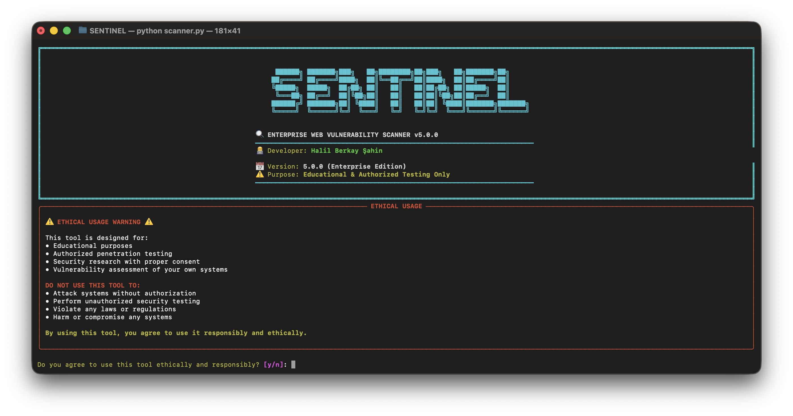

# SENTINEL

**Red Team Platform v6.0.0**

Enterprise-grade red team platform with 57 scanning modules, campaign management, payload framework, OOB callback infrastructure, and MITRE ATT&CK coverage tracking. Built for professional penetration testing and red team operations.

[](https://python.org)
[](https://fastapi.tiangolo.com)
[](LICENSE)

---

## Features

**Red Team Operations**
- Campaign management with multi-target scope enforcement
- MITRE ATT&CK phase tracking (Recon → Initial Access → ... → C2)
- Team collaboration with role-based access (lead / operator / observer)
- OOB callback listener for blind SSRF / XXE / OAST verification
- Threat actor profiles (10+ built-in APT TTPs: APT28, APT29, Lazarus, etc.)
- Attack chain correlation and risk scoring

**Scanning Engine**
- 57 lazily-loaded scanning modules (OWASP Top 10 2025 full coverage)
- Payload builder with 8 encoder/obfuscator chains (base64, hex, URL, HTML, unicode...)
- WAF bypass mutation engine with 12 tamper strategies
- External tool integration: Nmap, Nikto, Gobuster, John, Hashcat
- Authenticated scanning with session management
- WebSocket, GraphQL, gRPC protocol support

**Reporting**
- JSON, HTML, Markdown, SARIF, MITRE ATT&CK-mapped formats
- AI-powered executive summaries via Google Gemini
- PoC generator per vulnerability
- CVSS v3.1 automatic scoring

**Infrastructure**
- FastAPI REST API (v1) with JWT + RBAC auth
- PostgreSQL (prod) / SQLite (dev) via SQLAlchemy 2.0 async
- Redis caching + Celery distributed task queue
- Prometheus metrics + OpenTelemetry tracing
- Docker multi-stage build + docker-compose orchestration

---

## Screenshots

### Web Dashboard


### CLI Scanner



---

## Quick Start

### Docker (Recommended)

```bash
git clone https://github.com/halilberkayy/SENTINEL.git
cd SENTINEL

cp .env.example .env
# Set required values: POSTGRES_PASSWORD, SECRET_KEY, GEMINI_API_KEY

docker-compose -f docker/docker-compose.yml up -d
```

API: `http://localhost:8000/api/docs`
Web: `http://localhost:8000`

### Local

```bash
# Install dependencies
poetry install

# Configure
cp .env.example .env

# Run migrations
alembic upgrade head

# Start
python web_app.py
```

**Requirements:** Python 3.10+, PostgreSQL 13+ (optional), Redis 6+ (optional)

---

## Usage

### CLI

```bash
# Basic scan
poetry run scanner -u https://example.com

# Specific modules
poetry run scanner -u https://example.com -m xss_scanner,sqli_scanner,ssrf_scanner

# All modules
poetry run scanner -u https://example.com --modules all

# Authenticated scan
poetry run scanner -u https://example.com \
  --auth-type cookie \
  --auth-cookie "session=abc123"

# SARIF output (GitHub Security)
poetry run scanner -u https://example.com \
  --output sarif \
  --output-file results.sarif

# Red team profile
poetry run sentinel-redteam scan \
  --profile apt28 \
  --campaign-id <id> \
  --target https://example.com
```

### API

```bash
# Login
curl -X POST http://localhost:8000/api/v1/auth/login \
  -H "Content-Type: application/json" \
  -d '{"username": "admin", "password": "..."}'

# Create campaign
curl -X POST http://localhost:8000/api/v1/campaigns \
  -H "Authorization: Bearer <token>" \
  -d '{"name": "Q1 Red Team", "scope": {"allowed_domains": ["example.com"]}}'

# Start scan
curl -X POST http://localhost:8000/api/v1/scans \
  -H "Authorization: Bearer <token>" \
  -d '{"target_url": "https://example.com", "modules": ["xss_scanner", "sqli_scanner"]}'
```

Full API reference: [`docs/API_REFERENCE.md`](docs/API_REFERENCE.md)

---

## Scanning Modules

### Injection
`xss_scanner` · `sqli_scanner` · `command_injection_scanner` · `ssti_scanner` · `ssrf_scanner` · `xxe_scanner` · `lfi_rfi_scanner` · `ssi_scanner` · `sqli_exploiter` · `xxe_blind_helper`

### Authentication & Session
`jwt_scanner` · `csrf_scanner` · `auth_scanner` · `broken_access_control_scanner` · `hash_cracker`

### Reconnaissance
`recon_scanner` · `subdomain_scanner` · `port_scanner` · `nmap_scanner` · `nikto_scanner` · `gobuster_scanner` · `directory_scanner` · `robots_txt_scanner` · `security_txt_scanner` · `js_secrets_scanner` · `wordlist_builder`

### API & Protocols
`api_scanner` · `graphql_scanner` · `grpc_scanner` · `websocket_scanner` · `sse_scanner` · `proto_pollution_scanner` · `protocol_scanner` · `mobile_api_scanner`

### Infrastructure
`cors_scanner` · `headers_scanner` · `security_misconfig_scanner` · `dependency_scanner` · `supply_chain_scanner` · `cloud_scanner` · `waf_detector` · `rate_limit_scanner` · `recursive_scanner`

### Vulnerability Classes
`deserialization_scanner` · `open_redirect_scanner` · `race_condition_scanner` · `exception_scanner` · `logging_scanner`

### Offensive / Red Team
`c2_detection_scanner` · `post_exploit_scanner` · `persistence_scanner` · `evasion_scanner` · `stealth_ops_scanner` · `exfiltration_scanner` · `ldap_ad_scanner` · `social_engineering_scanner` · `credential_scanner` · `webshell_scanner` · `webshell_uploader_module`

---

## Architecture

```
SENTINEL/
├── src/
│   ├── api/                  # FastAPI app, middleware, v1 routes
│   │   ├── middleware/       # Auth (JWT), rate limiting
│   │   └── v1/               # campaigns, scans, payloads, oob, threats
│   ├── core/                 # Engine, config, DB, cache, security
│   │   ├── database/         # SQLAlchemy models + Alembic migrations
│   │   ├── security/         # JWT, RBAC, secrets
│   │   ├── scanner_engine.py # Lazy module registry + async orchestrator
│   │   ├── payload_builder.py
│   │   ├── mutation_engine.py
│   │   ├── oob_listener.py
│   │   └── threat_profiles.py
│   ├── modules/              # 57 scanning modules
│   ├── reporting/            # JSON, HTML, SARIF, MITRE, AI narrator
│   ├── cli/                  # Click CLI + red team commands
│   ├── web/                  # Web dashboard (FastAPI + WebSocket)
│   └── plugins/              # Plugin system
├── tests/
│   └── unit/                 # 15 test files
├── web/                      # Frontend HTML/CSS/JS
├── wordlists/                # Attack dictionaries
├── docker/                   # docker-compose + prometheus config
├── migrations/               # Alembic migration files
└── docs/                     # API reference, architecture, guides
```

**Stack:** FastAPI · SQLAlchemy 2.0 async · PostgreSQL · Redis · Celery · PyJWT · Prometheus · OpenTelemetry · Google Gemini · Poetry · Docker

---

## Database Schema

| Table | Description |
|-------|-------------|
| `users` | Accounts with RBAC roles (viewer / scanner / admin) |
| `scan_jobs` | Scan lifecycle (pending → running → completed / failed) |
| `vulnerabilities` | Findings linked to scans (severity, CWE, CVSS, PoC) |
| `audit_logs` | Security audit trail |
| `plugins` | Plugin registry |
| `campaigns` | Red team campaigns with scope and phase tracking |
| `campaign_targets` | Targets per campaign with individual status |
| `campaign_members` | Team roles per campaign |
| `findings` | Campaign-level findings with notes and status |
| `oob_interactions` | Out-of-band callback hits |
| `payload_records` | Payload effectiveness tracking |
| `threat_profiles` | APT profiles with MITRE TTP mappings |

---

## Testing

```bash
# All tests
pytest

# Unit tests with coverage
pytest tests/unit/ --cov=src --cov-report=html

# Code quality
ruff check src/
black --check src/
mypy src/
bandit -r src/
```

---

## Documentation

| Doc | Description |
|-----|-------------|
| [`docs/API_REFERENCE.md`](docs/API_REFERENCE.md) | Full REST API reference (v6.0.0) |
| [`docs/ARCHITECTURE.md`](docs/ARCHITECTURE.md) | System architecture and design decisions |
| [`docs/EXTERNAL_TOOLS.md`](docs/EXTERNAL_TOOLS.md) | External tool setup (Nmap, Nikto, Gobuster...) |
| [`docs/PLUGIN_DEVELOPMENT.md`](docs/PLUGIN_DEVELOPMENT.md) | Custom module development guide |
| [`DEPLOYMENT_GUIDE.md`](DEPLOYMENT_GUIDE.md) | Docker, production, and cloud deployment |

---

## Legal

This tool is for **authorized security testing only**.

- Obtain written authorization before scanning any target
- Only use within defined scope (bug bounty, pentest engagement, systems you own)
- Unauthorized use is illegal and prohibited

Users are solely responsible for compliance with applicable laws.

---

**Developed by [Halil Berkay Şahin](https://github.com/halilberkayy)**
Issues & feature requests → [GitHub Issues](https://github.com/halilberkayy/SENTINEL/issues)
